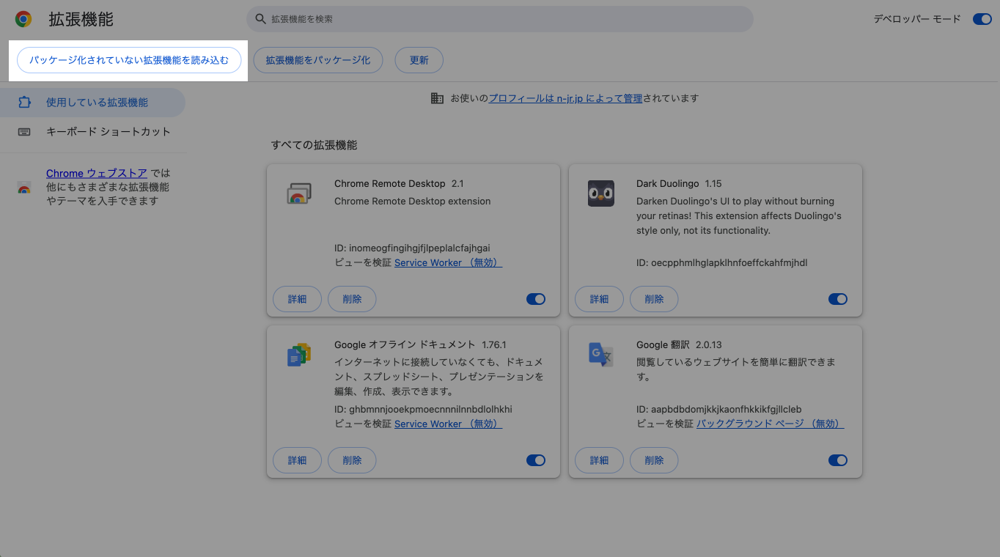
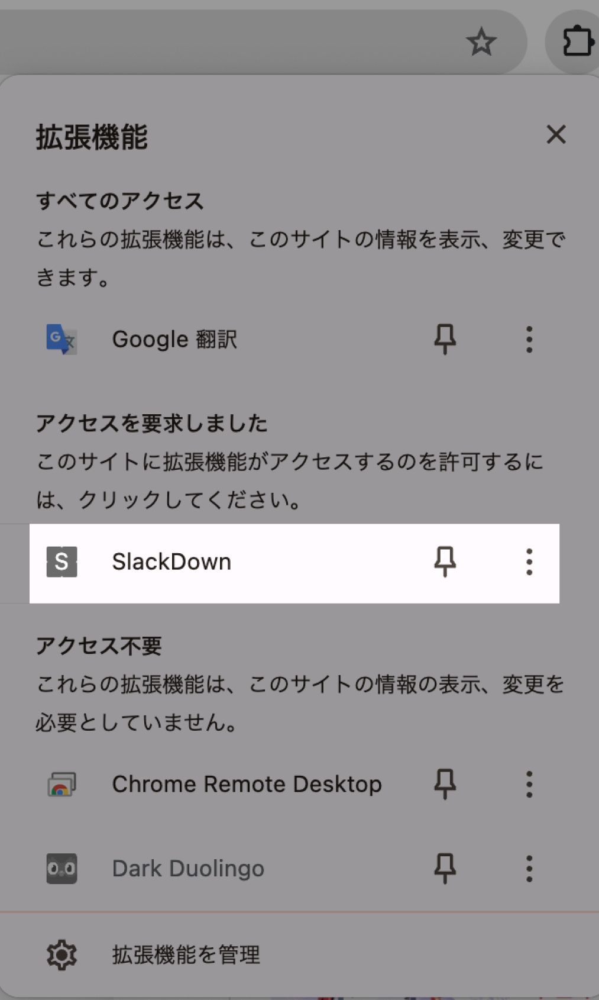

# 導入方法

### Latestマークが付いているものをクリック
<div style="text-align: center;">
    
</div>

___

### ```SlackDown.zip```をクリック

<div style="text-align: center;">
    
</div>

___

### ダウンロードした```SlackDown.zip```を解凍(ファイルをダブルクリック)

<div style="text-align: center;">
    
</div>

___

### ```拡張機能を管理```をクリック

<div style="text-align: center;">
    
</div>

___

### デベロッパーモードを```オン```にする

<div style="text-align: center;">
    
</div>

___

### ```パッケージ化されていない拡張機能を読み込む```をクリック

<div style="text-align: center;">
    
</div>

___

### 解凍した```SlackDown```を選択

<div style="text-align: center;">
    
</div>

___

### これが追加されたらOK

<div style="text-align: center;">
    
</div>

___

### SlackのWeb版を開いてスレットを開き、拡張機能から```SlackDown```をクリックするとスクロールされます！

<div style="text-align: center;">
    
</div>